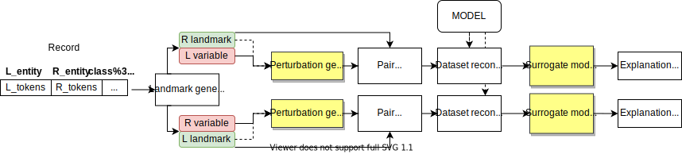

# Landmark Explanation
*Landmark Explanation* is an Entity Matching specific explanation framework based on LIME.


The state of the art approaches for performing Entity Matching (EM) rely on machine & deep learning models for inferring pairs of matching / non-matching entities.
Although the experimental evaluations demonstrate that these approaches are effective, their adoption in real scenarios is limited by the fact that they
are difficult to interpret.
Explainable AI systems have been recently proposed for complementing deep learning approaches.
Their application to the scenario offered by EM is still new and requires to address the specificity of this task, characterized by particular dataset schemas,
describing a pair of entities, and imbalanced classes. 
This paper introduces *Landmark*, a generic and extensible framework that extends the capabilities of a post-hoc perturbation-based explainer over the EM scenario.
*Landmark* generates perturbations that take advantage of the particular schemas of the EM datasets, thus generating explanations more accurate and more *interesting*
for the users than the ones generated by competing approaches.

## Framework




### Quick Start: Landmark Explanation in 30 seconds

Run:

```sh
git clone https://github.com/softlab-unimore/landmark.git
pip install -r landmark/requirements.txt
```

Import Landmark

```python
from landmark import Landmark
```
Initialize it passing the predict method of your model.

```python
explainer = Landmark(model.predict, df, exclude_attrs=['id','label'], lprefix='left_', rprefix='right_')
```

Explain EM model over an element of your data.

```python
el = df.sample()
exp = explainer.explain(el)
```
Plot your explanation

```python
explainer.plot(exp, el)
```

## Working example

Get started with Landmark Explanation!

[Here](https://github.com/softlab-unimore/landmark/blob/master/quick_start_magellan.ipynb) you can find a working notebook in which we explain a [Magellan](https://github.com/anhaidgroup/py_entitymatching) model.

[Here](https://github.com/softlab-unimore/landmark/blob/master/quick_start_DeepMatcher.ipynb) you can find a working notebook in which we explain a [DeepMatcher](https://github.com/anhaidgroup/deepmatcher) model.

## Reference

For a detailed description of the work please read [our paper](https://openproceedings.org/2021/conf/edbt/p259.pdf). Please cite the paper if you use the code from this repository in your work.

```
@inproceedings{DBLP:conf/edbt/BaraldiBP021,
  author    = {Andrea Baraldi and
               Francesco Del Buono and
               Matteo Paganelli and
               Francesco Guerra},
  title     = {Using Landmarks for Explaining Entity Matching Models},
  booktitle = {{EDBT}},
  pages     = {451--456},
  publisher = {OpenProceedings.org},
  year      = {2021}
}
```

## License
[MIT License](LICENSE)


